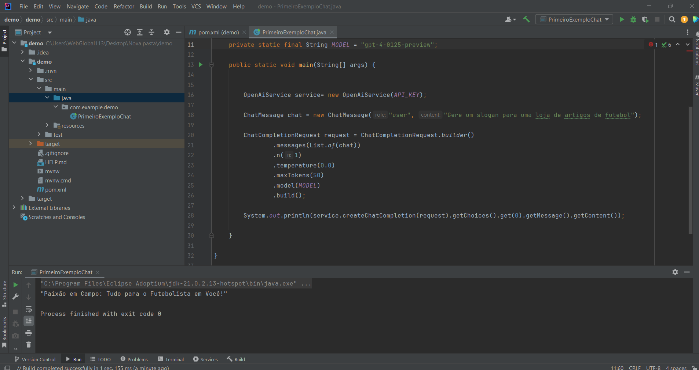

# API Chat GPT Java Client

Este projeto, construído sobre o robusto framework Spring Boot, implementa um cliente Java para a interação com a API GPT-4 Turbo da OpenAI. Aproveitando as funcionalidades do Spring Boot, o cliente proporciona um meio eficiente e estruturado de enviar perguntas em linguagem natural e receber respostas coerentes e contextualizadas. Isso viabiliza uma ampla gama de aplicações, desde testes de integração até o desenvolvimento de interfaces conversacionais inteligentes.

O projeto utiliza um conjunto de dependências recomendadas pela OpenAI, que estão especificadas no `pom.xml`, garantindo a comunicação adequada com a API da GPT-4 e a conformidade com as melhores práticas de desenvolvimento.

Configurações disponíveis no cliente:

- **Modelo**: Configurado para usar o `gpt-4-0125-preview`, que representa o que há de mais avançado em modelos de linguagem, proporcionando respostas rápidas e de alta qualidade.
  
- **Temperatura**: Este parâmetro controla a variabilidade das respostas geradas. Uma temperatura mais baixa gera respostas mais consistentes e diretas, enquanto uma mais alta incentiva respostas criativas e variadas.
  
- **Limite de Tokens**: Define o comprimento máximo da resposta gerada pela API. Com um controle granular sobre o número de tokens, o cliente pode obter respostas mais concisas ou mais elaboradas conforme a necessidade.
  
- **Número de Respostas**: Permite especificar quantas respostas a API deve retornar por solicitação, possibilitando a obtenção de múltiplas perspectivas para uma única pergunta.

Ajustando essas configurações através do cliente Spring Boot, os desenvolvedores podem adaptar as interações para atender especificações precisas de aplicativos e fluxos de trabalho. Essa capacidade faz deste projeto uma ferramenta essencial para quem busca integrar a sofisticação do GPT-4 em soluções de tecnologia conversacional.

## Amostra do projeto




## Objetivo do Projeto

O propósito central deste projeto é realizar uma série de testes exploratórios com a API GPT-4 Turbo da OpenAI, enfocando na parametrização fina das interações de perguntas e respostas. Este cliente Java serve como um laboratório de testes para:

- Avaliar a flexibilidade do modelo de linguagem em diferentes contextos e tipos de perguntas.
- Experimentar com as configurações de resposta, como a ajustabilidade da temperatura para equilibrar entre previsibilidade e criatividade nas respostas.
- Determinar os limites ótimos de tokens que garantem respostas completas sem redundância.
- Testar a viabilidade de múltiplas respostas para enriquecer a tomada de decisão ou gerar ideias diversificadas.

Os insights e configurações afinadas aqui serão posteriormente incorporados em projetos mais complexos que demandam interações naturais e inteligentes com usuários, como chatbots, assistentes virtuais e interfaces de usuário conversacionais. A meta é aproveitar a capacidade de processamento de linguagem natural de última geração para criar aplicações mais intuitivas, responsivas e úteis.


## Estrutura do Projeto

apiChatGpt
├── src
│   ├── main
│   │   ├── java
│   │   │   ├── com
│   │   │   │   ├── example
│   │   │   │   │   ├── demo
│   │   │   │   │   │   ├── PrimeiroExemploChat.java
├── target
    ├── ... (Arquivos compilados e empacotados)


O arquivo `PrimeiroExemploChat.java` contém o código para enviar mensagens e receber respostas da API do Chat GPT.

## Como usar

Para executar o projeto, você precisará de uma chave API válida do OpenAI, que deve ser inserida no arquivo `PrimeiroExemploChat.java`.

Após configurar a chave da API, você pode construir e executar o projeto com Maven:

```bash
mvn clean install
java -cp target/nome-do-artefato.jar com.example.demo.PrimeiroExemploChat
Substitua nome-do-artefato.jar pelo nome do arquivo JAR gerado pelo Maven.

Contribuições
Contribuições são bem-vindas! Sinta-se à vontade para enviar um pull request.

Licença
Este projeto está licenciado sob a Licença MIT - veja o arquivo LICENSE.md para detalhes.
